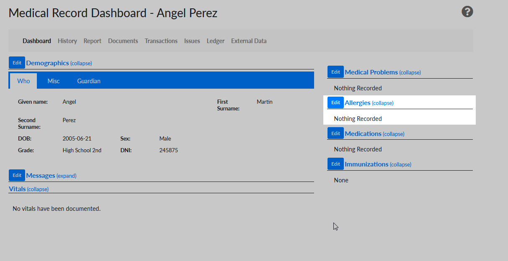
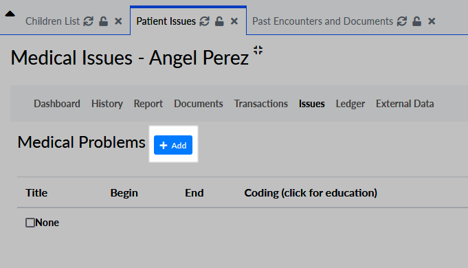
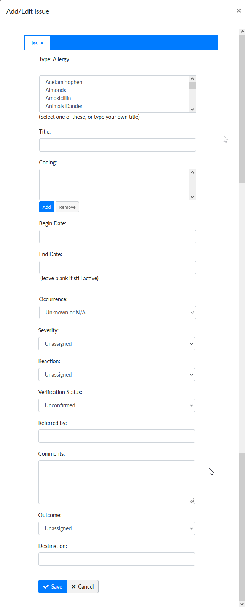

Allergy management is one of the core functionalities of the Azul Wasi OpenEMR installation.

## Viewing Allergies

Allergy information can be viewed from the Medical Records Dashboard. See 
[Medical Record Dashboard Overview](medical-record-dashboard/overview.html) for more information. Once on the Medical
Records Dashboard, Allergies are listed on the right column.

## Add a New Allergy

1. From the Allergy Card found on the Medical Record Dashboard, click on the "Edit" button on the top of the Card. This
launches the Medical Issues page. 

2. Click the "Add" button next to the Allergies title. 
3. The Allergy Popup is displayed. The only required information is the Title field, although it is highly recommended to also fill out the Severity field and Reaction fields. You can click the name of common allergies from the Quick Pick List or type your own in the title field.

4. Once the information is entered, click "Save"